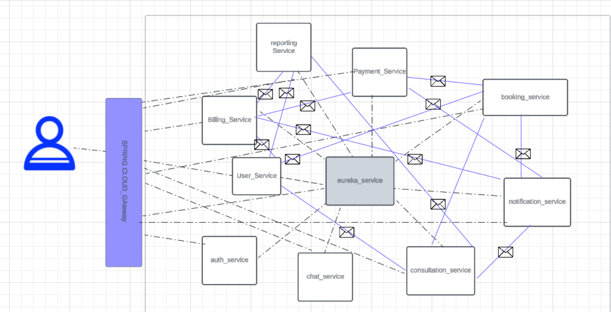

Ce projet de plateforme de santé en ligne utilise une architecture microservices pour offrir une flexibilité, une scalabilité et une sécurité renforcées. Construit avec Spring Boot pour les services backend, Spring Cloud pour la gestion des microservices, et React.js pour l’interface utilisateur frontend, le système est structuré de façon modulaire, avec chaque service gérant une fonction spécifique. La communication entre les microservices est assurée par des API REST et Kafka pour la gestion de la communication asynchrone, permettant un flux de données en temps réel et une gestion fiable des événements. L’API Gateway et le registre de services Eureka permettent le routage et la découverte des services.

Cette architecture améliore l'expérience utilisateur en fournissant une interface réactive et assure une coordination fluide entre les modules de la plateforme.

Objectif du Projet
Cette plateforme de santé a pour but de fournir aux patients et praticiens un accès pratique aux consultations médicales, à la prise de rendez-vous et aux paiements en ligne. L'architecture microservices permet une gestion efficace des processus métier et des mises à jour continues, sans interruption de service.

Architecture et Services :
API Gateway

Fonction : Point d'entrée unique pour tous les utilisateurs, dirigeant les requêtes vers les services appropriés.
Technologie : Spring Cloud Gateway.
Communication : Gère les demandes via des API REST, gère l'authentification et l'autorisation des utilisateurs.
Service Registry (Eureka)

Fonction : Enregistrement des services pour faciliter la découverte et le routage entre microservices.
Technologie : Eureka Server (Spring Cloud Netflix).
Communication : Permet aux services de se découvrir et de communiquer selon les besoins.
User Service

Fonction : Gère l'authentification des utilisateurs et les informations de profil.
Technologies : Spring Boot, Spring Security, JWT pour l'authentification.
Communication :
Avec Booking Service pour valider les informations utilisateur lors de la prise de rendez-vous.
Avec Consultation Service pour les consultations spécifiques.
Avec Billing Service pour récupérer les informations de facturation.
Booking Service

Fonction : Gère les réservations en vérifiant les disponibilités et en confirmant les paiements.
Technologies : Spring Boot, MongoDB pour stocker les réservations.
Communication :
Avec User Service pour vérifier les informations utilisateur.
Avec Consultation Service pour vérifier les créneaux disponibles.
Avec Payment Service pour vérifier le statut de paiement avant la confirmation.
Avec Notification Service pour envoyer les confirmations et rappels de rendez-vous via Kafka.
Consultation Service

Fonction : Facilite les consultations et gère les créneaux disponibles.
Technologies : Spring Boot, Kafka pour la synchronisation des messages.
Communication :
Avec Booking Service pour la gestion des créneaux et réservations.
Avec User Service pour les détails du patient et praticien.
Avec Reporting Service pour envoyer les données des consultations.
Payment Service

Fonction : Gère les transactions de manière sécurisée.
Technologies : Spring Boot, intégration avec des passerelles de paiement (ex : Stripe, PayPal).
Communication :
Avec Billing Service pour la validation des informations de facturation.
Avec Notification Service pour les confirmations de paiement.
Avec Booking Service pour confirmer le statut de paiement.
Billing Service

Fonction : Gestion de la facturation avec génération des montants et émission de factures.
Technologies : Spring Boot, MySQL pour le stockage des informations de facturation.
Communication :
Avec Payment Service pour la validation des paiements.
Avec User Service pour l'historique de facturation.
Avec Notification Service pour envoyer les factures.
Notification Service

Fonction : Gère l'envoi des notifications (confirmations, rappels, mises à jour).
Technologies : Spring Boot, Kafka pour la gestion asynchrone des messages.
Communication :
Avec Booking Service, Payment Service, Consultation Service et Billing Service pour envoyer les notifications pertinentes aux utilisateurs.
Reporting Service

Fonction : Produit des rapports d'activité et des analyses pour le suivi des performances.
Technologies : Spring Boot, MongoDB pour le stockage des données analytiques.
Communication :
Avec Consultation Service, Billing Service et User Service pour collecter les données pour les rapports.
Technologies Utilisées
Backend : Spring Boot pour chaque microservice, Spring Cloud pour la gestion des services (Gateway, Eureka).
Frontend : React.js pour l'interface utilisateur.
Bases de données : MongoDB pour les données de réservation et de consultation, MySQL pour la facturation.
API : RESTful API pour la communication interservices.
Message Queue : Kafka pour la communication asynchrone entre services.
Sécurité : JWT pour l'authentification des utilisateurs.